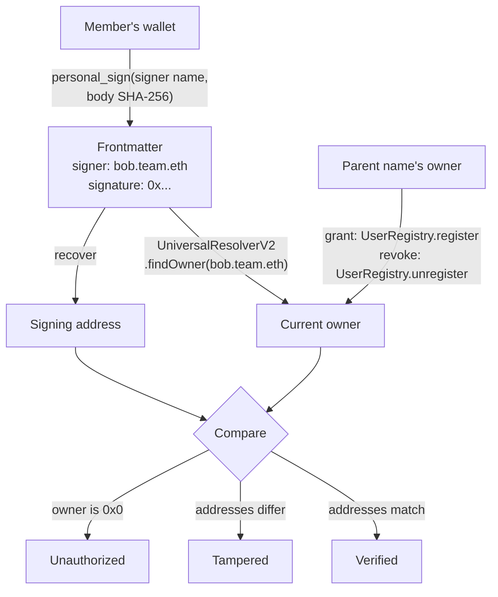

# md-ens-signature

Sign Markdown files with an ENS name, and verify them against ENSv2 permissions.

**Live page:** https://capsulizers.github.io/md-ens-signature/

## The problem

AI agents execute Markdown: skills, prompts, and notes that tell them what to
do, often with real money or real systems behind them. Such a file moves between
people, repositories, and sync folders, and anyone along the way can change one
line. Who wrote this file, and do they still have the right to?

## The answer

The author signs the file's body and puts the signature in its frontmatter, next
to their ENS name:

```md
---
title: Mean reversion on BTC 4h
signer: bob.mdsig91205.eth
signature: "0xa583...f91c"
---
```

The permission is ENSv2 membership. A team owns a name such as `mdsig91205.eth`
with its own ENSv2 registry; the team's owner grants a member a subname like
`bob.mdsig91205.eth` and can revoke it at any time. A verifier recovers the
signing address and asks ENSv2 who owns the signer name right now. The answer is
one of four verdicts:

| Verdict      | Meaning                                                                                                      |
| ------------ | ------------------------------------------------------------------------------------------------------------ |
| Verified     | The current owner of the signer name signed this exact body.                                                 |
| Tampered     | The body changed, or someone other than the owner signed it.                                                 |
| Unauthorized | The signature is valid, but ENSv2 says the name may not sign now, for example because the parent revoked it. |
| Unsigned     | The file has no signature.                                                                                   |

## 30-second demo

No wallet needed; the page reads ENSv2 on Sepolia directly.

1. Open the [live page](https://capsulizers.github.io/md-ens-signature/), then
   copy the raw text of [`signed-by-member.md`](examples/signed-by-member.md)
   into the Markdown file box. It shows **Verified**: `bob.mdsig91205.eth` is a
   member and its owner signed the body.
2. In the box, change `under 30` to `under 35`. It turns **Tampered**.
3. Replace the text with
   [`signed-by-revoked.md`](examples/signed-by-revoked.md). It shows
   **Unauthorized**: the team's owner revoked `carol.mdsig91205.eth`, so a file
   signed while it was granted no longer counts.

| Step                       | Live page                                                                                                                                               |
| -------------------------- | ------------------------------------------------------------------------------------------------------------------------------------------------------- |
| 1. A member's file         |          |
| 2. One number edited       |          |
| 3. A revoked member's file |  |

With a wallet on Sepolia, the same page signs files, creates a team name, and
grants or revokes members.

## How it works



- **Sign.** The signed message is EIP-191 `personal_sign` text naming the signer
  and the SHA-256 of the body, so MetaMask can make it. Other frontmatter keys
  are left out of the signature and kept byte for byte.
- **Verify.** Recover the address from the signature, then ask the ENSv2
  `UniversalResolverV2.findOwner` on Sepolia who owns the signer name. No owner
  means Unauthorized; a different owner means Tampered; the same owner means
  Verified.
- **Grant and revoke.** Only the parent name's owner can. Granting calls
  `register` on the parent's own `UserRegistry`, making the member the owner of
  their subname with no roles, so they cannot transfer or unregister it.
  Revoking calls `unregister`, and every file that name signed stops verifying.

## Why ENSv2 is central

ENSv2 is the permission system, not a lookup on the side. Without it a signature
only proves that some key signed; with it, the signature says a named member of
a team signed, and the team can take that back. Contract addresses come from the
ENSv2 Sepolia deployment list; team names, their registries, and their members
are read from the chain at run time.

| ENSv2 feature                        | How this project uses it                                                                                                                                                   | Source and Sepolia address                                                                                                                                                                                                                                                                                                                                                                                                                                                                                     |
| ------------------------------------ | -------------------------------------------------------------------------------------------------------------------------------------------------------------------------- | -------------------------------------------------------------------------------------------------------------------------------------------------------------------------------------------------------------------------------------------------------------------------------------------------------------------------------------------------------------------------------------------------------------------------------------------------------------------------------------------------------------- |
| Hierarchical registries              | Each team name gets its own `UserRegistry`, and members are subnames in it.                                                                                                | [`UserRegistry`](https://github.com/ensdomains/contracts-v2/blob/48b3e2d39513b9dd32ef1850877a29009bc807b9/contracts/src/registry/UserRegistry.sol#L43), [`PermissionedRegistry`](https://github.com/ensdomains/contracts-v2/blob/48b3e2d39513b9dd32ef1850877a29009bc807b9/contracts/src/registry/PermissionedRegistry.sol#L181) / [`UserRegistryImpl`](https://sepolia.etherscan.io/address/0x840fa461059862ea466a711e8c98c8de732061c0)                                                                        |
| `VerifiableFactory`                  | The page deploys the team's registry and resolver as proxies whose code anyone can verify.                                                                                 | [`deployProxy`](https://github.com/ensdomains/verifiable-factory/blob/c1090aec465ab30d494c96bd7d2a147b4f0b0173/src/VerifiableFactory.sol#L32) / [`VerifiableFactory`](https://sepolia.etherscan.io/address/0x118bc31a50d559f7015a8da26d54b3b030cdb70f)                                                                                                                                                                                                                                                         |
| Enhanced Access Control role bitmaps | The team owner holds every root role, so they can register and unregister any label. Members get `roleBitmap` 0: they cannot transfer, re-point, or unregister their name. | [`EnhancedAccessControl`](https://github.com/ensdomains/contracts-v2/blob/48b3e2d39513b9dd32ef1850877a29009bc807b9/contracts/src/access-control/EnhancedAccessControl.sol#L19), [transfer check](https://github.com/ensdomains/contracts-v2/blob/48b3e2d39513b9dd32ef1850877a29009bc807b9/contracts/src/registry/PermissionedRegistry.sol#L489), [`unregister`](https://github.com/ensdomains/contracts-v2/blob/48b3e2d39513b9dd32ef1850877a29009bc807b9/contracts/src/registry/PermissionedRegistry.sol#L198) |
| `PermissionedResolver`               | Each team deploys one and points the team name at its owner's address.                                                                                                     | [`PermissionedResolver`](https://github.com/ensdomains/contracts-v2/blob/48b3e2d39513b9dd32ef1850877a29009bc807b9/contracts/src/resolver/PermissionedResolver.sol#L409) / [`PermissionedResolverImpl`](https://sepolia.etherscan.io/address/0x7e4b2d59938930168024201752ee5503df402303)                                                                                                                                                                                                                        |
| `ETHRegistrar` with a stablecoin     | The page registers a team `.eth` name with commit and reveal, paid in test USDC.                                                                                           | [`ETHRegistrar`](https://github.com/ensdomains/contracts-v2/blob/48b3e2d39513b9dd32ef1850877a29009bc807b9/contracts/src/registrar/ETHRegistrar.sol#L123) / [`ETHRegistrar`](https://sepolia.etherscan.io/address/0xa4449a0dd2b83007553d9b1d28b583a46a805a30), [`MockUSDC`](https://sepolia.etherscan.io/address/0xd3322b29a7bdee707d1684676f149bf41aa3422f)                                                                                                                                                    |
| `UniversalResolverV2.findOwner`      | Every verifier, in Rust, WebAssembly, and the CLI, asks it who owns the signer name now. The page also uses `findExactRegistry` to find a team's registry.                 | [`findOwner`](https://github.com/ensdomains/contracts-v2/blob/48b3e2d39513b9dd32ef1850877a29009bc807b9/contracts/src/universalResolver/UniversalResolverV2.sol#L69) / [`UniversalResolverV2`](https://sepolia.etherscan.io/address/0x85edf8b6b7d4211e2b07aa687506b746357b92cf)                                                                                                                                                                                                                                 |

In this repository, the verification rule lives in
[the library's `verify`](crates/md-ens-signature/src/verify.rs) and the
`findOwner` call in [`ens.rs`](crates/md-ens-signature/src/ens.rs); the page's
team setup and grant and revoke calls are in
[`chain-team-engine.ts`](web/src/engine/chain-team-engine.ts) and
[`chain-permissions-engine.ts`](web/src/engine/chain-permissions-engine.ts). The
demo's `carol.mdsig91205.eth` was
[granted](https://sepolia.etherscan.io/tx/0xa1c17c61c314a8506568ba8dae704f668e7c2e3a7e7c1b14447ae50dfbc0c6b6)
and then
[revoked](https://sepolia.etherscan.io/tx/0x094faa043c71fbe857b34f24cb38cbd56e3df4d89500a21ee98616800f7ce12d)
this way.

### Why not `resolve(addr)`

The obvious check, resolving the signer name's `addr` record, gives the wrong
answer after a revoke. ENSv2 resolution
[walks up to the nearest resolver](https://github.com/ensdomains/contracts-v2/blob/48b3e2d39513b9dd32ef1850877a29009bc807b9/contracts/src/universalResolver/libraries/LibRegistry.sol#L21),
so once `carol.team.eth` is unregistered, the team's resolver still answers for
it. `findOwner` asks the parent's registry itself, which returns the zero
address the moment the label is unregistered or expires.

### Honest limits

- **Trust is a Sepolia RPC node.** Verifiers believe what their node returns for
  `findOwner`. Any node works, and both the page and the CLI take your own, but
  nothing checks the answer against a light client.
- **A signature proves who, not what.** Verified means a current member signed
  this exact body. It says nothing about whether the content is safe to run.
- **Revocation is retroactive by design.** Verification asks who owns the name
  now, so revoking a member also invalidates every file they signed before, and
  granting the name again to a new address makes old files Tampered. That is the
  point for agent skills, but it is not an archive-style timestamp.
- **Sepolia only.** ENSv2 is not on mainnet yet; the addresses above are its
  Sepolia deployment.

## Existing project vs built at ETHGlobal

This is an ENSv2 integration into Memona, Capsulizers' Markdown note app.

| Existed before the event                                                                                                       | Built at ETHGlobal Tokyo                                                                                                                                                                |
| ------------------------------------------------------------------------------------------------------------------------------ | --------------------------------------------------------------------------------------------------------------------------------------------------------------------------------------- |
| Memona, a Tauri desktop and web note app in Rust and TypeScript, developed since 2023 (private source)                         | This repository: the sans-IO Rust library, the `mdsig` CLI, the WebAssembly bindings, and the live page                                                                                 |
| Memona's plugin runtime and store, which let a WASI plugin open remote storage as a folder                                     | The [Memona signature plugin](https://git.capsulizers.com/commons/memona-plugin-signature), which signs every Markdown file saved through it and shows the verdict as a badge in Memona |
| The [WebDAV filesystem plugin](https://git.capsulizers.com/commons/memona-plugin-webdav), which the signature plugin builds on | Memona fixes the end-to-end run turned up, such as a frontmatter editor that rewrote a long hex signature                                                                               |

The signature plugin uses this library as a git dependency, so Memona, the CLI,
and the page all run the same verification code.

## Run locally

Prerequisites:

- A current stable Rust toolchain from [rustup](https://rustup.rs).
- For the page, [Deno](https://deno.com) 2, the `wasm32-unknown-unknown` Rust
  target, and `wasm-bindgen` 0.2.108, the exact version the bindings pin.

```sh
git clone https://github.com/capsulizers/md-ens-signature
cd md-ens-signature
```

### Command line

Install `mdsig`:

```sh
cargo install --path crates/mdsig
```

Verify the demo files against ENSv2 on Sepolia. Exit codes are 0 verified, 2
unsigned, 3 unauthorized, 4 tampered, and 1 on an error.

```sh
mdsig verify examples/signed-by-member.md
mdsig verify examples/signed-by-revoked.md
mdsig verify examples/signed-by-member.md --parent mdsig91205.eth --json
```

The example note is unsigned, so `inspect` exits with 2:

```sh
mdsig inspect examples/trading-skill.md
```

Sign it into a new file. The key is a well-known test key that anyone can use,
so never send funds to it. `mdsig` reads keys only from an environment variable,
never from its arguments.

```sh
export MDSIG_PRIVATE_KEY=0x4c0883a69102937d6231471b5dbb6204fe5129617082792ae468d01a3f362318
mdsig sign examples/trading-skill.md --signer bob.alice.eth --output signed.md
mdsig inspect signed.md
```

`inspect` recovers `0x2c7536E3605D9C16a7a3D7b1898e529396a65c23`, the test key's
address. Change one threshold in the body and inspect again: the signature now
recovers a different address, so the edit shows.

```sh
sed 's/under 30/under 35/' signed.md > edited.md
mdsig inspect edited.md
```

`inspect` works offline. `verify` asks ENSv2 who owns the signer name:

```sh
mdsig verify signed.md
```

The test key owns no `bob.alice.eth` on Sepolia, so this exits with 3,
unauthorized. `--parent` accepts only that name and its subnames, `--rpc` picks
another Sepolia node, and `--json` prints the verdict as JSON.

### Web page

```sh
rustup target add wasm32-unknown-unknown
cargo install wasm-bindgen-cli --version 0.2.108
cd web
deno task build-wasm
deno task dev
```

`build-wasm` compiles the library to WebAssembly and writes its bindings into
the page; `dev` serves the page at the address Vite prints, by default
http://localhost:5173/. Verifying needs no wallet; signing and managing members
need a browser wallet such as MetaMask on Sepolia.

## AI assistance

This project was built with [Claude Code](https://claude.com/claude-code).
Agents wrote most of the code, tests, and documentation, including this README,
under the direction of the Capsulizers team, who set the design, the file
format, and the ENSv2 permission model. Every change landed as a small pull
request with passing CI; the
[merged pull requests](https://github.com/capsulizers/md-ens-signature/pulls?q=is%3Apr+is%3Amerged)
record what each one did and how it was checked.
