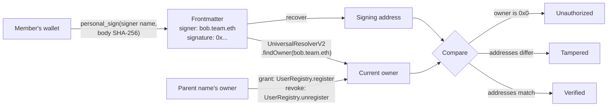

# md-ens-signature

Sign Markdown files with an ENS name, and verify them against ENSv2 permissions.

**Live page:** https://capsulizers.github.io/md-ens-signature/

## The problem

AI agents execute Markdown: skills, prompts, and notes that tell them what to
do, often with real money or real systems behind them. Such a file moves between
people, repositories, and sync folders, and anyone along the way can change one
line. Who wrote this file, and do they still have the right to?

## The answer

The author signs the file's body and puts the signature in its frontmatter, next
to their ENS name:

```md
---
title: Mean reversion on BTC 4h
signer: bob.mdsig91205.eth
signature: "0xa583...f91c"
---
```

The permission is ENSv2 membership. A team owns a name such as `mdsig91205.eth`
with its own ENSv2 registry; the team's owner grants a member a subname like
`bob.mdsig91205.eth` and can revoke it at any time. A verifier recovers the
signing address and asks ENSv2 who owns the signer name right now. The answer is
one of four verdicts:

| Verdict      | Meaning                                                                                                      |
| ------------ | ------------------------------------------------------------------------------------------------------------ |
| Verified     | The current owner of the signer name signed this exact body.                                                 |
| Tampered     | The body changed, or someone other than the owner signed it.                                                 |
| Unauthorized | The signature is valid, but ENSv2 says the name may not sign now, for example because the parent revoked it. |
| Unsigned     | The file has no signature.                                                                                   |

## 30-second demo

No wallet needed; the page reads ENSv2 on Sepolia directly.

1. Open the [live page](https://capsulizers.github.io/md-ens-signature/), then
   copy the raw text of [`signed-by-member.md`](examples/signed-by-member.md)
   into the Markdown file box. It shows **Verified**: `bob.mdsig91205.eth` is a
   member and its owner signed the body.
2. In the box, change `under 30` to `under 35`. It turns **Tampered**.
3. Replace the text with
   [`signed-by-revoked.md`](examples/signed-by-revoked.md). It shows
   **Unauthorized**: the team's owner revoked `carol.mdsig91205.eth`, so her
   signature no longer counts.

| Step                       | Live page                                                                                                                                               |
| -------------------------- | ------------------------------------------------------------------------------------------------------------------------------------------------------- |
| 1. A member's file         |          |
| 2. One number edited       |          |
| 3. A revoked member's file |  |

With a wallet on Sepolia, the same page signs files, creates a team name, and
grants or revokes members.

## How it works



- **Sign.** The signed message is EIP-191 `personal_sign` text naming the signer
  and the SHA-256 of the body, so MetaMask can make it. Other frontmatter keys
  are left out of the signature and kept byte for byte.
- **Verify.** Recover the address from the signature, then ask the ENSv2
  `UniversalResolverV2.findOwner` on Sepolia who owns the signer name. No owner
  means Unauthorized; a different owner means Tampered; the same owner means
  Verified.
- **Grant and revoke.** Only the parent name's owner can. Granting calls
  `register` on the parent's own `UserRegistry`, making the member the owner of
  their subname with no roles, so they cannot transfer or unregister it.
  Revoking calls `unregister`, and every file that name signed stops verifying.

## Try it

Install the `mdsig` command line tool with a Rust toolchain:

```sh
git clone https://github.com/capsulizers/md-ens-signature
cd md-ens-signature
cargo install --path crates/mdsig
```

The example note is unsigned, so `inspect` exits with 2:

```sh
mdsig inspect examples/trading-skill.md
```

Sign it into a new file. The key is a well-known test key that anyone can use,
so never send funds to it. `mdsig` reads keys only from an environment variable,
never from its arguments.

```sh
export MDSIG_PRIVATE_KEY=0x4c0883a69102937d6231471b5dbb6204fe5129617082792ae468d01a3f362318
mdsig sign examples/trading-skill.md --signer bob.alice.eth --output signed.md
mdsig inspect signed.md
```

`inspect` recovers `0x2c7536E3605D9C16a7a3D7b1898e529396a65c23`, the test key's
address. Change one threshold in the body and inspect again: the signature now
recovers a different address, so the edit shows.

```sh
sed 's/under 30/under 35/' signed.md > edited.md
mdsig inspect edited.md
```

`inspect` works offline. `verify` also asks ENSv2 on Sepolia who owns the signer
name and compares that owner with the recovered address:

```sh
mdsig verify signed.md
```

The test key owns no `bob.alice.eth` on Sepolia, so this exits with 3,
unauthorized. A file signed by the owner of a registered name exits with 0, and
an edited body exits with 4. `--parent alice.eth` accepts only that name and its
subnames, `--rpc` picks another Sepolia node, and `--json` prints the verdict as
JSON.
